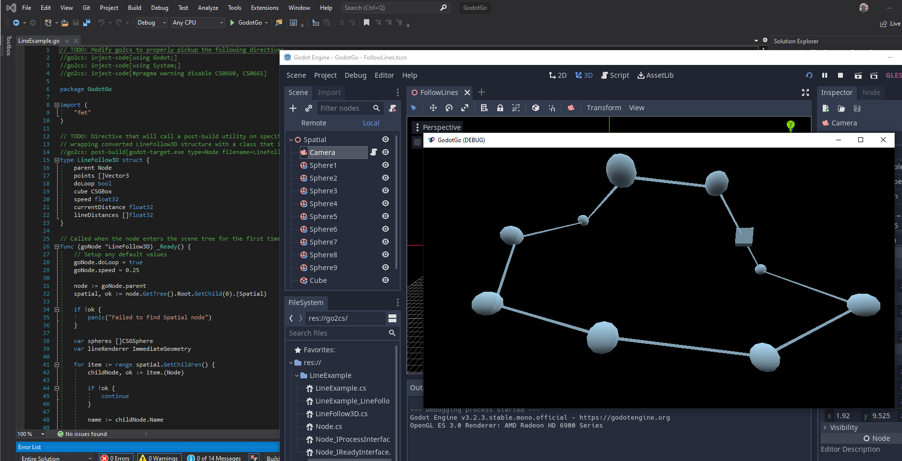

# GodotGo
GoLang Script Handler for Godot

### Using Golang as a scripting language for Godot

Using the [`go2cs`](https://go2cs.net/) source converter, you can use [Golang](https://golang.org/ref/spec) as a scripting language for the [Godot](https://Godot.com/) gaming platform.

Initial Example:
* Source Golang-based Godot Script: [LineExample.go](../src/GodotGo/LineExample.go)
  * Script based on the following [C# Godot script](../src/GodotGo/OriginalScript.cs) that makes use of the [Line Renderer](https://godotengine.org/asset-library/asset/268) asset
* Current [`go2cs`](https://go2cs.net/) Converted C# Script: [LineExample.cs](../src/GodotGo/LineExample.cs)
  * _Fully automated conversion is close, but not 100% yet. Will need some `directive` parsing and better cast handling added to [`go2cs`](https://go2cs.net/)_
* Desired (Operational) Conversion: [LineExample-DesiredTarget.cs](../src/GodotGo/LineExample-DesiredTarget.cs)
* Target Godot Script ([`Node`](https://docs.godotengine.org/en/stable/classes/class_node.html) class wrapper for converted struct): [LineFollow3D.cs](../src/GodotGo/LineFollow3D.cs)
* Initial Go-based Node implementation: [Node.go](../src/GodotGo/Node.go)

